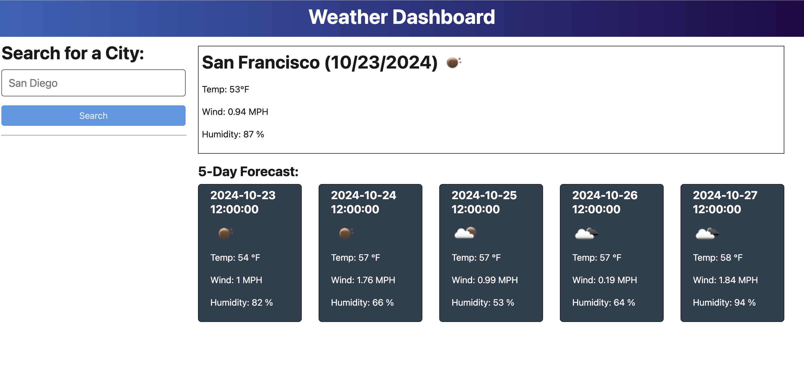

<div align="center">
<h1> Weather Dashboard Application</h1></div>


### Description
This Weather Dashboard allows users to view the current weather and a 5-day forecast for multiple cities. It fetches real-time weather data from the OpenWeather 5-day forecast API and displays it in a user-friendly interface. Users can search for a city and get detailed information on weather conditions including temperature, humidity, wind speed, and weather icons for both the current day and the future forecast.

### Features
#### Search Cities:
Users can input a city name to view its current and future weather conditions.
#### Weather Data:
Displays the city name, weather icons, temperature, humidity, wind speed, and a weather description.
#### Search History: 
Keeps track of searched cities and allows users to click on them to re-display weather data.
5-Day Forecast: Provides a 5-day forecast with essential weather details.

### Technologies Used
- Node.js for server-side functionality.
- Express.js for setting up API routes.
- OpenWeather API for retrieving weather data.
- HTML/CSS/JavaScript for building the front end.
- Fetch API for making API requests to OpenWeather.
- JSON for storing search history.

### API Routes
- GET /api/weather/history: Returns all saved cities from searchHistory.json as JSON.
- POST /api/weather: Receives a city name, saves it to searchHistory.json, and returns weather data for that city.
- DELETE /api/weather/history/:id: Deletes a city from the searchHistory.json by its unique ID.

### Installation
Clone the repository:
```bash
git clone https://github.com/your-username/weather-dashboard.git
```

### Install dependencies:
```bash
npm install
```

### Set up the OpenWeather API:
Register on OpenWeather and get your API key.
Create a .env file and add your API key:
```bash
API_KEY=your_api_key
```

### Start the server:
```bash
npm start
```

### Usage
Open the application in the browser and enter the name of a city to view its current weather and 5-day forecast.
The search history will show previously searched cities, which can be clicked on to view their weather data again.

### Deployment
This application is deployed on Render. 

### License
This project is licensed under the MIT License.

### Screenshot


### Contact
Feel free to reach out for further information:
- Email: matthewpmendez@gmail.com
- Github Profile: https://github.com/Plutarch1971 
- LinkedIn: https://www.linkedin.com/feed/
- Render: https://weather-dashboard-s6xb.onrender.com


